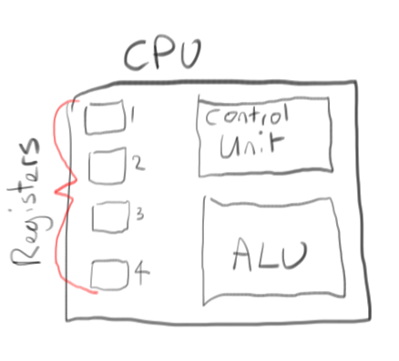
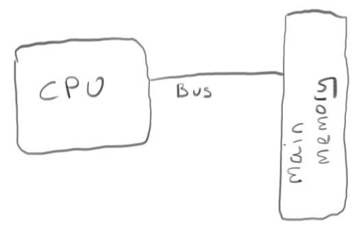
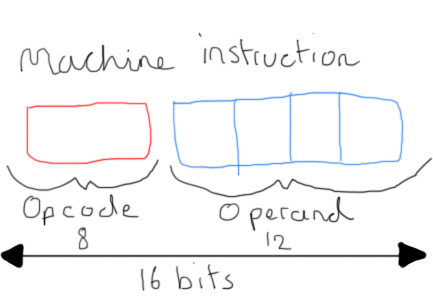
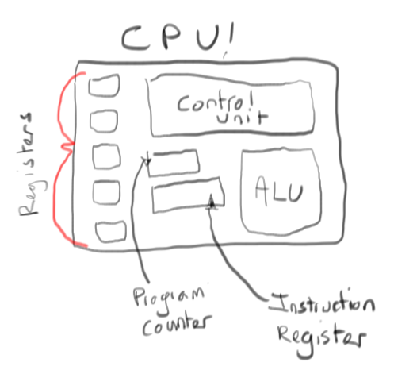
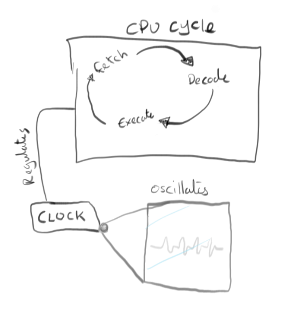
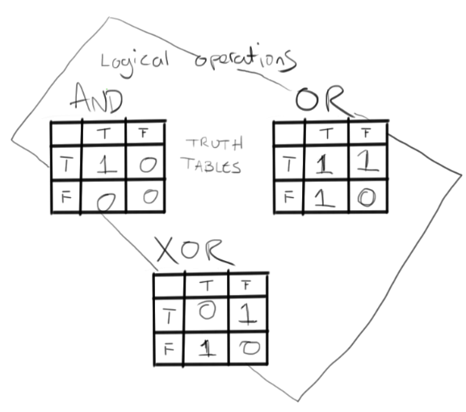

These notes are a summary of Brookshear's *Computer Science, an overview* (2000)

Section 2.1 The Central Processing Unit
=============================================================================================
* Stands for *Central Processing Unit*
* The CPU consists of two parts
	* The **Arithmetic/Logic unit** (*ALU*)
		* The circuitry that performs data manipuation
	* The **Control Unit**
		* The circuitry for coordinating machine activies

Registers
---------------------------
* For temporary storage of information, the CPU contains cells or **registers**  that are similar to main memory cells. 
* Often called *general-purpose registers* or *special purpose registers*
* They serve as temporary holding areas for data being manipulated by the CPU such as
	* Inputs/outputs to the ALU
* To perform operations on data stored in main memory, it is the responsibility of the *control unit* to: - 
	* Transfer the data into the registers
	* Inform the *ALU* which registers hold the pertinent data to operate on
	* Inform the *ALU* what register should receive the result 
* Registers hold data that should be immediately accessible, whereas main memory is for data that is less likely to be needed in the near future
* In many modern computers, an addtional level of storage called *cache memory* which can be used to temporarily store data from main memory that can be used by the CPU, offering the ability to make less round trips when receiving and storing data before finally committing to main memory if needed

	

Bus
---------------------------

* To transfer data between the CPU and main memory, data is transferred by a collection of wires called a *bus* 
* Through this bus the CPU is able to read memory via its address and similarly write to memory in the same manner

	

Instructing the machine
---------------------------

With the above tools in mind, the CPU performs its operations in sequence which is collectively called a *program*. These operations are defined by a series of **machine instructions**  that fall into 3 categories: -

* Data transfer
	* Operations to transfer/copy data from one location to another
* Arithmetic/Logic
	* Instructions to manipulate data within the *ALU*, such as logical operations such as AND, OR, XOR and NOT and traditional addition and subtraction
* Control
	* Instructions that, according to  "direct the execution of the program rather than the manipulation of data" 
	* This includes condintional operations that support branching e.g. CMP (compare) and JUMP

Questions/Exercises 
----------------------------
**Q: What sequence of events do you think would be required in a machine to move the contents of one memory cell to another**

A: First the machine must LOAD the memory from memory location #1 and store it in register A. The second instruction should then STORE the contents of register A in memory location #2 i.e.

	LOAD memory location 1 into register A
	STORE contents of register A in memory location #2

**Q: What information must the CPU supply to the main memory circuitry to write a value into a memory cell?**

A: The CPU will need to provide the data (i.e. the *value*) to write and the memory location to write to.

**Q: Why might the term *move* be considered an incorrect name for the operation of moving data from one location in a machine to another?**

A: *Moving* implies that the data is being removed from one location and placed into another, leaving a blank space behind. Copying/Cloning would be a more appropriate term 

**Q: Is the instruction ```if 0 equals 0, then JUMP to Step 7``` a conditional or unconditional jump? Explain your answer**

A: This is a conditional jump as the instruction is prefixed with a condition. Even though the parameters of this particular statement would always evaluate to true, the statement still needs to be evaluated before the decision is made to execute the "then" part of of the instruction

Section 2.2 The Stored Program Concept
======================================================================
Early computers stored their excutable programs directly into the machine, as part of the control unit. This was obviously cumbersome and while swappable control units were a partial solution, the real breakthrough came with the idea to store programs in main memory. 

Stored Programs
-------------------------------------
The stored program concept goes hand in hand with a machine to interpret the program using a language collectively known as *machine language*. 

A **machine instruction** typically consists of two parts, an **operation code** (or *op-code*) and an **operand**. The *op-code* tells the machine what type of instruction should be performed (e.g. ADD,OR, AND, SUB, LOAD) and the *operand* provides the information needed by that operation

* For example the LOAD instruction requires a memory location and a register to load it into

Word size
------------------------------------------------
A CPU represents numbers as integers (in base 2), the size of numbers it can represent in one unit is called the **word size**. This means that the amount of addressable memory is limited to the word size of your CPU. So for example, a CPU with a **word size** of 8 bits can address a maximum of 256 memory locations (2^8)

A typical computer 
--------------------------------------
The following diagram represents a simple computer with the following credentials

* 16 8 bit general purpose registers, labelled 0 - 15 (addressable via `0 - F` in hexadecimal)
* 256 8 bit main memory cells (256 bytes) addressable via `00-FF` in hexadecimal
* Each **machine instruction** is 2 bytes long (16 bits)
	* The first 4 bits are reserved for the **op-code**
	* The remaining 12 bits are reserved for the **operand** read as 3 4 bit items



### Small Machine language 
**Machine instructions** are nothing more than just a series of bits that are interpreted by the CPU. Our machine language describes the first four bits as the op-code and the remanining 12 bits as the operand. The operand is split into 3 4 bit chunks or a *nibble*

Here is a machine language for our typical computer

<table style="font-size:0.8em; table-layout:fixed;">
	<tr>
		<th>Op-code</th>
		<th>Operand</th>
		<th>Description</th>
	</tr>
	<tr>
		<td>1</td>
		<td>R X Y</td>
		<td>LOAD the register R with the data found in memory cell with address XY</td>
	</tr>
	<tr>
		<td>2</td>
		<td>R X Y</td>
		<td>LOAD the register R with the value XY</td>
	</tr>
	<tr>
		<td>3</td>
		<td>R X Y</td>
		<td>STORE the value in register R in the memory cell with address XY</td>
	</tr>
	<tr>
		<td>4</td>
		<td>0 R S</td>
		<td>MOVE the value in register R to the register S</td>
	</tr>
	<tr>
		<td>5</td>
		<td>R S T</td>
		<td>ADD the values in registers S and T and store the result in register R</td>
	</tr>
	<tr>
		<td>6</td>
		<td>R S T</td>
		<td>ADD the values in registers S and T in floating point format and store the result in register R</td>
	</tr>
	<tr>
		<td>7</td>
		<td>R S T</td>
		<td>OR the values in registers S and T in store the result in register R</td>
	</tr>
	<tr>
		<td>8</td>
		<td>R S T</td>
		<td>AND the values in registers S and T in store the result in register R</td>
	</tr>
	<tr>
		<td>9</td>
		<td>R S T</td>
		<td>XOR the values in registers S and T in store the result in register R</td>
	</tr>
	<tr>
		<td>A</td>
		<td>R 0 X</td>
		<td>ROTATE the value in register R to the right X times</td>
	</tr>
	<tr>
		<td>B</td>
		<td>R X Y</td>
		<td>JUMP to the instruction located in the memory cell XY if the value in register R is equal to the value in register 0</td>
	</tr>
	<tr>
		<td>C</td>
		<td>0 0 0</td>
		<td>HALT execution</td>
	</tr>
	<caption><strong>Table:</strong> The specification for our machine language</caption>
</table>

### An example program
The following program will add two numbers together. 

	156C // LOAD value from memory location 6C into register 5
	166D // LOAD value from memory location 6D into register 6
	5056 // ADD the values in registers 5 and 6 and store the result in register 0
	306E // STORE the value in register 0 into memory location 6E
	C000 // HALT execution

Observations: -

* The program is 10 bytes in size (80 bits)

Questions/Exercises 
----------------------------
**Q: Write the example program above in binary**

A: Easy to read version

	0001 0101 0110 1100 // 1 5 6 C
	0001 0110 0110 1101 // 1 6 6 D
	0101 0000 0101 0110 // 5 0 5 6
	0011 0000 0110 1110 // 3 0 6 E
	1100 0000 0000 0000 // C 0 0 0 
	
A: Machine version 

	0001010101101100 0001011001101101 0101000001010110 0011000001101110 1100000000000000

**Q: Write the following machine instructions in english**

* 368A
	* A: STORE the value located in register 6 into the memory cell addressed 8A 
* BADE
	* A: JUMP to instruction located in memory cell DE if value in register A is equal to value in register 0
* 803C
	* A: AND the values in registers 3 and C and store the result in register 0
* 40F4
	* A: MOVE the value in register F to the register 4

**Q: What is the difference between the instructions 15AB and 25AB in our machine language?**

A: Instruction 15AB will load the contents of memory cell AB into register 5, whereas instruction 25AB will load the *value* AB (decimal 171) into register 5
	
**Q: Here are some instruction in english. Translate them into our machine language**

* *LOAD register number 3 with the hexadecimal value 56*
	* A: 2356
* *ROTATE register number 5 three bits to the right*
	* A: A503
* *JUMP to the instruction located at F3 if the contents of register 7 is equal to the contents of register 0*
	* A: B7F3
* *AND the contents of register A with the contents of register 5 and put the result in register 0*
	* A: 80A5

Section 2.3 Program Execution
===========================================================

The computer follows a program stored in memory by copying the insturctions from memory into the control unit as needed. 

* The order instructions are fetched from memory usually corresponds to the order they are stored in memory 
	* Unless otherwise specified by a JUMP instruction

To control the flow of instructions in the computer, inside the *control unit* you can find two *special purpose registers* called the **Program Counter (PC)** and the **Instruction Register (IR)**.

**Program Counter**

The program counter contains the address of the next instruction to be executed, serving as the machines way of keeping track of where it is in the program.

**Instruction Register**

The instruction register is used to hold the instruction being executed



The retrieval, analysis and exection of machine instructions happens continually until the machine is halted. This cycle is called the **fetch**, **decode** and **execute** cycle. This operates as follows

1. **Fetch** the next instruction from memory based on the address stored in the program counter and put it in the instruction register. Increment the program counter to point to the next instruction 
2. **Decode** the instruction in the instruction register into its component parts, the op-code and the operand. 
3. **Execute** the instruction according to the circuitry of the computer.
4. Go to step 1

This continual loop needs to be synchronised and is done so using a **clock** that oscillates back and forth between 0 and 1 and the circuitry of the CPU respond to this. The speed of the clock determines the speed of the machine cycle performed by the CPU.

   

Executing a program
----------------------------
If we take the program we wrote in section 2.2 and store it in our main memory, starting at address A0 (160) 

<table style="font-size:0.8em; table-layout:fixed;">
	<tr>
		<th>Address</th>
		<th>Value</th>
	</tr>
	<tr>
		<td>A0</td>
		<td>15</td>
	</tr>
	<tr>
		<td>A1</td>
		<td>6C</td>
	</tr>
	<tr>
		<td>A2</td>
		<td>16</td>
	</tr>
	<tr>
		<td>A3</td>
		<td>6D</td>
	</tr>
	<tr>
		<td>A4</td>
		<td>50</td>
	</tr>
	<tr>
		<td>A5</td>
		<td>56</td>
	</tr>
	<tr>
		<td>A6</td>
		<td>30</td>
	</tr>
	<tr>
		<td>A7</td>
		<td>6E</td>
	</tr>
	<tr>
		<td>A8</td>
		<td>C0</td>
	</tr>
	<tr>
		<td>A9</td>
		<td>00</td>
	</tr>
</table>

With the following data
<table style="font-size:0.8em; table-layout:fixed;">
	<tr>
		<th>Address</th>
		<th>Value</th>
	</tr>
	<tr>
		<td>6C</td>
		<td>08</td>
	</tr>
	<tr>
		<td>6D</td>
		<td>02</td>
	</tr>
	<tr>
		<td>6E</td>
		<td>00</td>
	</tr>
</table>


As each memory cell can only hold 1 byte of data, each machine instruction spans 2 cells of memory. The instruction register holds 16 bits of data, so the fetch instruction must fetch both locations to fill the IR.

The following table represents the state of the CPU after each step when running our program. Remember to consider the state of the memory above as this will be used by the program

<table style="font-size:0.8em; table-layout:fixed;">
	<tr>
		<th colspan="3"></th>
		<th colspan="7" style="text-align:center;">General Purpose Registers</th>
	</tr>
	<tr>
		<th>Step</th>
		<th>Program Counter</th>
		<th>Instruction Register</th>
		<th>0</th>
		<th>1</th>
		<th>2</th>
		<th>3</th>
		<th>4</th>
		<th>5</th>
		<th>6</th>
	</tr>
	<tr>
		<td>START</td>
		<td>A0</td>
		<td></td>
		<td></td>
		<td></td>
		<td></td>
		<td></td>
		<td></td>
		<td></td>
		<td></td>
	</tr>
	<tr>
		<td>Fetch</td>
		<td>A2</td>
		<td>156C</td>
		<td></td>
		<td></td>
		<td></td>
		<td></td>
		<td></td>
		<td></td>
		<td></td>
	</tr>
	<tr>
		<td>Decode</td>
		<td>A2</td>
		<td>156C</td>
		<td></td>
		<td></td>
		<td></td>
		<td></td>
		<td></td>
		<td></td>
		<td></td>
	</tr>
	<tr>
		<td>Execute</td>
		<td>A2</td>
		<td>156C</td>
		<td></td>
		<td></td>
		<td></td>
		<td></td>
		<td></td>
		<td></td>
		<td></td>
	</tr>
	<tr>
		<td>Fetch</td>
		<td>A4</td>
		<td>166D</td>
		<td></td>
		<td></td>
		<td></td>
		<td></td>
		<td></td>
		<td>08</td>
		<td></td>
	</tr>
	<tr>
		<td>Decode</td>
		<td>A4</td>
		<td>166D</td>
		<td></td>
		<td></td>
		<td></td>
		<td></td>
		<td></td>
		<td>08</td>
		<td></td>
	</tr>
	<tr>
		<td>Execute</td>
		<td>A4</td>
		<td>166D</td>
		<td></td>
		<td></td>
		<td></td>
		<td></td>
		<td></td>
		<td>08</td>
		<td></td>
	</tr>
	<tr>
		<td>Fetch</td>
		<td>A6</td>
		<td>5056</td>
		<td></td>
		<td></td>
		<td></td>
		<td></td>
		<td></td>
		<td>08</td>
		<td>02</td>
	</tr>
	<tr>
		<td>Decode</td>
		<td>A6</td>
		<td>5056</td>
		<td></td>
		<td></td>
		<td></td>
		<td></td>
		<td></td>
		<td>08</td>
		<td>02</td>
	</tr>
	<tr>
		<td>Execute</td>
		<td>A6</td>
		<td>5056</td>
		<td></td>
		<td></td>
		<td></td>
		<td></td>
		<td></td>
		<td>08</td>
		<td>02</td>
	</tr>
	<tr>
		<td>Fetch</td>
		<td>A8</td>
		<td>306E</td>
		<td>0A</td>
		<td></td>
		<td></td>
		<td></td>
		<td></td>
		<td>08</td>
		<td>02</td>
	</tr>
	<tr>
		<td>Decode</td>
		<td>A8</td>
		<td>306E</td>
		<td>0A</td>
		<td></td>
		<td></td>
		<td></td>
		<td></td>
		<td>08</td>
		<td>02</td>
	</tr>
	<tr>
		<td>Execute</td>
		<td>A8</td>
		<td>306E</td>
		<td>0A</td>
		<td></td>
		<td></td>
		<td></td>
		<td></td>
		<td>08</td>
		<td>02</td>
	</tr>
	<tr>
		<td>Fetch</td>
		<td>AA</td>
		<td>C000</td>
		<td>0A</td>
		<td></td>
		<td></td>
		<td></td>
		<td></td>
		<td>08</td>
		<td>02</td>
	</tr>
	<tr>
		<td>Decode</td>
		<td>AA</td>
		<td>C000</td>
		<td>0A</td>
		<td></td>
		<td></td>
		<td></td>
		<td></td>
		<td>08</td>
		<td>02</td>
	</tr>
	<tr>
		<td>Execute</td>
		<td>AA</td>
		<td>C000</td>
		<td>0A</td>
		<td></td>
		<td></td>
		<td></td>
		<td></td>
		<td>08</td>
		<td>02</td>
	</tr>
	<tr>
		<td>END</td>
		<td>AA</td>
		<td></td>
		<td></td>
		<td></td>
		<td></td>
		<td></td>
		<td></td>
		<td></td>
		<td></td>
	</tr>
</table>

Programs vs. Data
--------------------------------------------------------
As you can see from the memory layout above, many programs can be stored in main memory as long as they reside in different locations. To run a particular program when the machine is started is determined by setting the program counter accordingly. 

*However* as we have seen, data used by our programs is also stored in memory and can also be executed by the CPU with interesting consequences, so proceed with caution!

Questions/Exercises 
--------------------------------------------------------
**Q: Suppose the main memory of our computer contains the following program**

<table style="font-size:0.8em; table-layout:fixed;">
	<tr>
		<th>Address</th>
		<th>Value</th>
	</tr>
	<tr>
		<td>00</td>
		<td>14</td>
	</tr>
	<tr>
		<td>01</td>
		<td>02</td>
	</tr>
	<tr>
		<td>02</td>
		<td>34</td>
	</tr>
	<tr>
		<td>03</td>
		<td>17</td>
	</tr>
	<tr>
		<td>04</td>
		<td>C0</td>
	</tr>
	<tr>
		<td>05</td>
		<td>00</td>
	</tr>
</table>

**If we set the program counter of the machine to 00 and start the machine, what will be the value in memory cell 17?**

A: The program is as follows

	1402 // LOAD value from memory location 02 into register 4
	3417 // STORE value in register 4 into memory location 17
	C000 // HALT

So the value in memory location 17 would be 34 (`0011 0100`)

**Q: Suppose the main memory of our computer contains the following program**

<table style="font-size:0.8em; table-layout:fixed;">
	<tr>
		<th>address</th>
		<th>value</th>
	</tr>
	<tr>
		<td>b0</td>
		<td>13</td>
	</tr>
	<tr>
		<td>B1</td>
		<td>B8</td>
	</tr>
	<tr>
		<td>B2</td>
		<td>A3</td>
	</tr>
	<tr>
		<td>B3</td>
		<td>02</td>
	</tr>
	<tr>
		<td>B4</td>
		<td>33</td>
	</tr>
	<tr>
		<td>B5</td>
		<td>B8</td>
	</tr>
	<tr>
		<td>B6</td>
		<td>C0</td>
	</tr>
	<tr>
		<td>B7</td>
		<td>00</td>
	</tr>
	<tr>
		<td>B8</td>
		<td>0F</td>
	</tr>
</table>

**If we set the program counter of the machine to B0, what value is in register 3 after the first instruction has been executed?**

A: Register 3 will contain the value 0F (`0000 1111`)

**...and what is the value of B8 after the HALT insutruction has been executed?**

A: The program is as follows

	13B8 // LOAD value from memory location B8 into register 3
	A302 // ROTATE the value in register 3 to the right 2 times 
	33B8 // STORE value in register 3 into memory location B8 
	C000 // HALT

So the value in memory location B8 would be C3 (`1100 0011`)

**Q: Suppose the main memory of our computer contains the following program**

<table style="font-size:0.8em; table-layout:fixed;">
	<tr>
		<th>address</th>
		<th>value</th>
	</tr>
	<tr>
		<td>A4</td>
		<td>20</td>
	</tr>
	<tr>
		<td>A5</td>
		<td>00</td>
	</tr>
	<tr>
		<td>A6</td>
		<td>21</td>
	</tr>
	<tr>
		<td>A7</td>
		<td>03</td>
	</tr>
	<tr>
		<td>A8</td>
		<td>22</td>
	</tr>
	<tr>
		<td>A9</td>
		<td>01</td>
	</tr>
	<tr>
		<td>AA</td>
		<td>B1</td>
	</tr>
	<tr>
		<td>AB</td>
		<td>B0</td>
	</tr>
	<tr>
		<td>AC</td>
		<td>50</td>
	</tr>
	<tr>
		<td>AD</td>
		<td>02</td>
	</tr>
	<tr>
		<td>AE</td>
		<td>B0</td>
	</tr>
	<tr>
		<td>AF</td>
		<td>AA</td>
	</tr>
	<tr>
		<td>B0</td>
		<td>C0</td>
	</tr>
	<tr>
		<td>B1</td>
		<td>00</td>
	</tr>
</table>

*For each question assume the machine is starting from memory address A4*

Full program


	2000 // LOAD the register 0 with value 00
	2103 // LOAD the register 1 with value 03
	2201 // LOAD ther egister 2 with value 01
	B1B0 // JUMP to the instruction loacted in B0 if the value in register 0 is equal to value in register 1
	5002 // ADD the values in register 0 and 2 and store the result in register 0
	B0AA // JUMP to the instruction located in AA if the value in register 0 is equal to value in register 0

**What is in the register 0 the first time the instruction at address AA is executed?**

A: 00

**What is in the register 0 the second time the instruction at address AA is executed?**

A: 01

**How many times is the program executed before the machine halts?**

A: 4 times

**Q: Suppose the main memory of our computer contains the following program**

<table style="font-size:0.8em; table-layout:fixed;">
	<tr>
		<th>address</th>
		<th>value</th>
	</tr>
	<tr>
		<td>F0</td>
		<td>20</td>
	</tr>
	<tr>
		<td>F1</td>
		<td>C0</td>
	</tr>
	<tr>
		<td>F2</td>
		<td>30</td>
	</tr>
	<tr>
		<td>F3</td>
		<td>F8</td>
	</tr>
	<tr>
		<td>F4</td>
		<td>20</td>
	</tr>
	<tr>
		<td>F5</td>
		<td>00</td>
	</tr>
	<tr>
		<td>F6</td>
		<td>30</td>
	</tr>
	<tr>
		<td>F7</td>
		<td>F9</td>
	</tr>
	<tr>
		<td>F8</td>
		<td>FF</td>
	</tr>
	<tr>
		<td>F9</td>
		<td>FF</td>
	</tr>
</table>

Full program

	20C0 // LOAD register 0 with the value C0
	30F8 // STORE the value in register 0 into memory address F8
	2000 // LOAD register 0 with the value 00
	30F9 // STORE the value in register 0 into the memory address F8

**If we start the machine with its program counter containing F0, what does the machine do when it reaches the instruction at address F8?**

A: Instructions 1 and 3 load the values C0 and 00 into memory locations F8 and F9 respectively. When the program counter hits F8 it will interpret this as the HALT instruction and will HALT the machine 

Arithmetic/Logic 
====================================================


Questions/Exercises
-------------------------
**Q: Suppose you want to isolate the middle three bits of a seven bit string by placing 0s in the other four bits without disturbing the middle three bits. What mask and operation must you use to achieve this?**

A: You would use an AND operation with the bit pattern `0011100`, e.g.

		1101011
	AND 0011100
	------------
		0001000

**Q: Suppose oyu want to complement the middle three bits of a seven bit string while leaving the other four bits undisturbuted. What mask and operation must you use to achieve this?**

A: You would use an XOR operation with the bit pattern `0011100`, e.g.

		1101011
	XOR 0011100
	------------
		1110111


